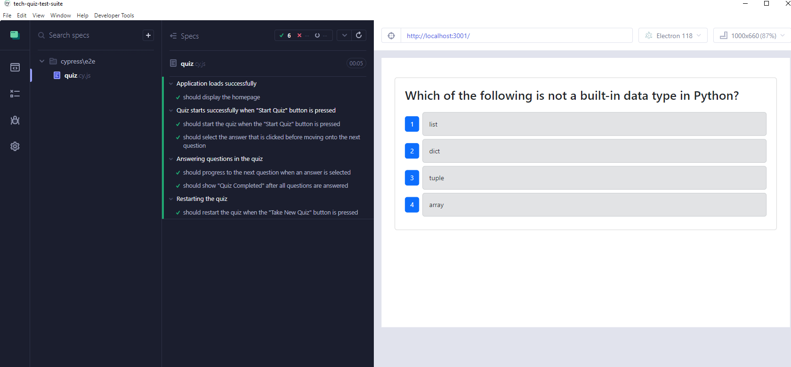

# Tech Quiz Test Suite - 
## Description

Created a test suite for an existing application with component testing and end to end testing

## Table of Contents 

- [Installation](#installation)
- [Usage](#usage)
- [Contributing](#contributing)
- [License](#license)
- [Features](#features)
- [How to Contribute](#how-to-contribute)
- [Tests](#tests)
- [Questions](#questions)

## Installation

n/a

## Usage

run test in cypress

## Contributing

Thank you for you contributions:

## License

This application is covered under the following license: MIT.
Click the license badge above for more information.

## Features

Component testing and End to End testing enabled

## How to Contribute

If you would like to contribute to this application, please consult the guidelines from The [Contributor Covenant](https://www.contributor-covenant.org/), an industry standard.

## Tests

https://youtu.be/qi2hmLjvFAU

## Questions

Github: http://github.com/hongfetti

Email: ryan.hong1994@gmail.com